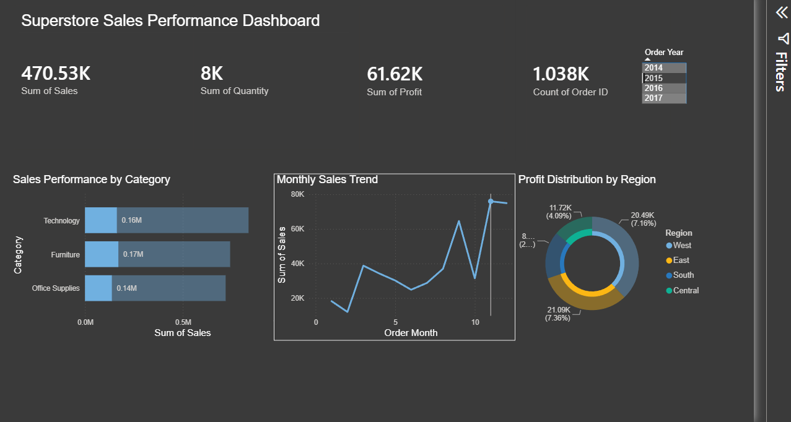

# Superstore Sales Analysis

End-to-end data analysis project covering data cleaning, exploratory analysis, SQL queries, and an interactive Power BI dashboard — all built on the classic Superstore retail dataset.

---

## Tools Used

- **Python** (pandas, NumPy) — data cleaning and EDA
- **SQL** (SQLite) — business questions and aggregations
- **Power BI** — interactive dashboard with KPIs and slicers
- **Excel** — source data

---

## Project Structure

```
├── 01_data_cleaning.ipynb        # data cleaning and EDA in Python
├── superstore_queries.sql        # SQL analysis queries with comments
├── Superstore_Cleaned.csv        # cleaned dataset ready for analysis
├── superstore.db                 # SQLite database
├── Superstore Sales Performance Dashboard.pbix   # Power BI dashboard
└── Sample - Superstore.csv       # original raw dataset
```

---

## What I Did

**Step 1 — Data Cleaning (Python)**

Loaded 9,994 rows and 21 columns. Checked for nulls and duplicates (none found). Converted date columns from string to datetime, extracted order month and year, and calculated shipping duration for each order. Exported the cleaned file for use in SQL and Power BI.

**Step 2 — Exploratory Analysis (Python + SQL)**

Ran both Python and SQL to answer the same business questions — partly to cross-validate results, partly to show both approaches.

**Step 3 — Dashboard (Power BI)**

Built an interactive dashboard with a year slicer, KPI cards, and three charts covering category performance, monthly trends, and regional profit distribution.

---

## Key Findings

1. **Technology** leads in both revenue ($836K) and profit ($145K). **Furniture** has nearly the same sales volume as Office Supplies but earns only $18K in profit — a 2.5% margin worth investigating.

2. **West** is the strongest region at 14.9% profit margin. **Central** has higher sales than South but a worse margin (7.9%) — suggesting a pricing or discount issue.

3. Discounts above 30% consistently produce losses. Orders in the 30–50% discount range average **-$156 profit per order**. This is likely a major driver of Furniture's weak margins.

4. **November and December** are peak months by sales volume. **February** is the slowest month of the year by a wide margin.

5. **Standard Class** shipping takes an average of 5 days vs 2.2 days for First Class — useful context if the business is evaluating logistics costs.

---

## Dashboard Preview



---

## SQL Queries

The `superstore_queries.sql` file contains four queries with inline comments explaining the logic and results. Each query mirrors the Python EDA to show the same insight reached through a different tool.

---

## How to Run

**Python notebook:**
```bash
pip install pandas numpy matplotlib seaborn
jupyter notebook 01_data_cleaning.ipynb
```

**SQL:**
Open `superstore.db` in DB Browser for SQLite, then run queries from `superstore_queries.sql`.

**Power BI:**
Open `Superstore Sales Performance Dashboard.pbix` in Power BI Desktop.

---

## Dataset

[Superstore Sales Dataset — Kaggle](https://www.kaggle.com/datasets/vivek468/superstore-dataset-final)

9,994 rows | 21 columns | Retail sales data (2014–2017)
